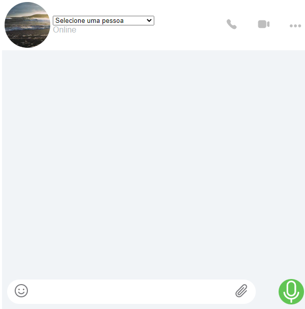

# WhatsLab

## 📄 Descrição

Projeto foi desenvolvido em React, simulando a página de bate-papo do Whatsapp, registrando o nome do usuário que enviou a mensagem.

[Clique aqui para acessar o projeto](https://react-message-seven.vercel.app/)

## ⚒️ Tecnologias 

## 📫 Contato

E-mail: marianaceott@gmail.com

